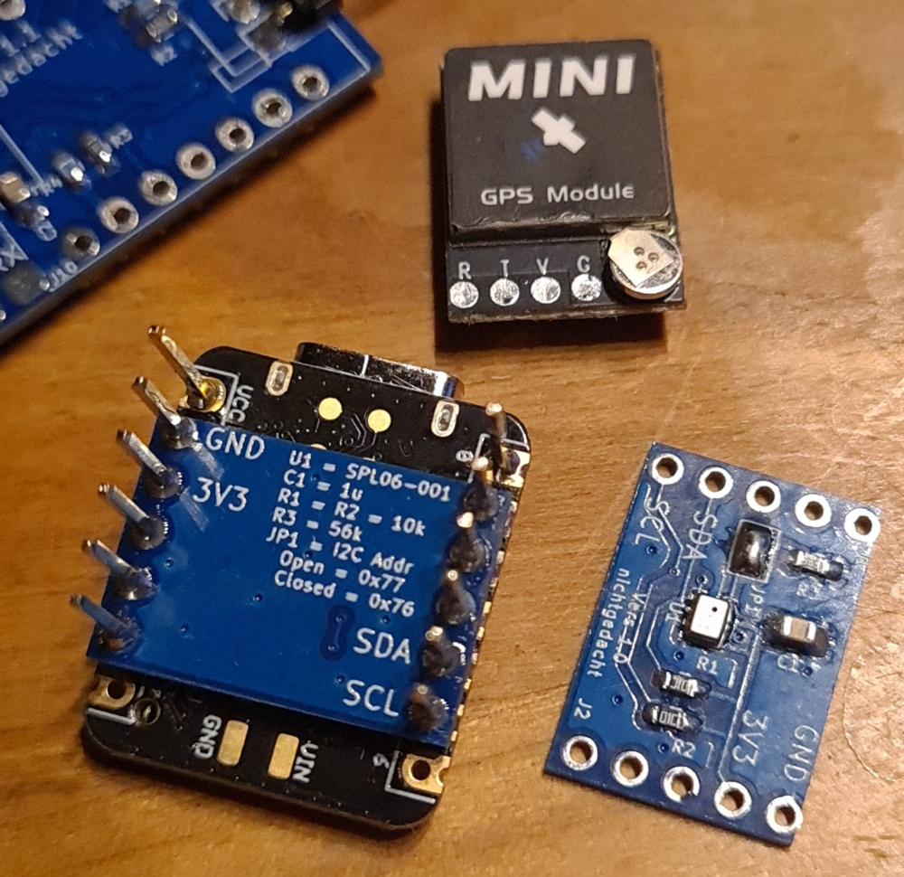
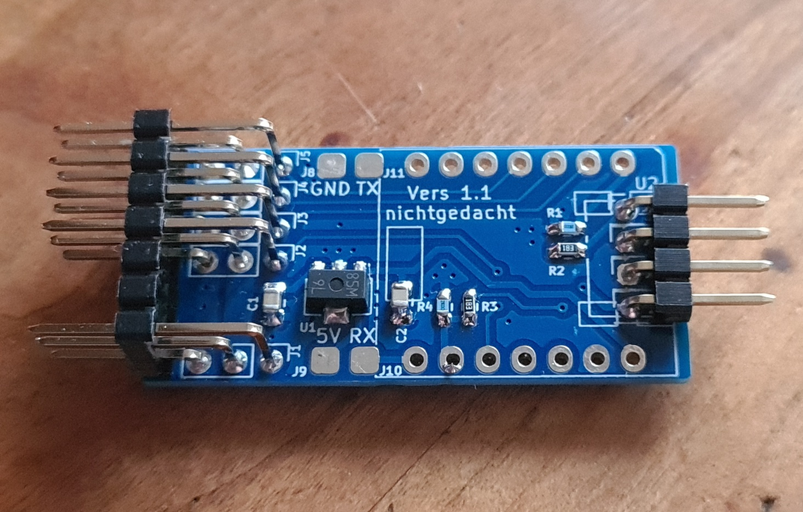
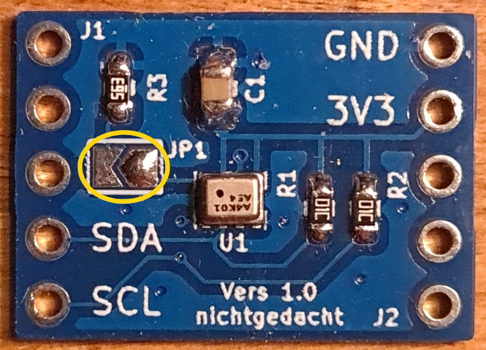
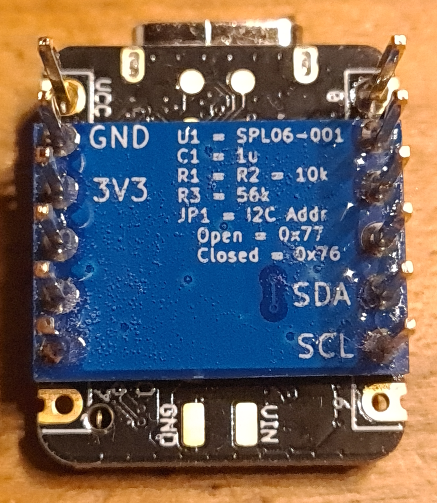
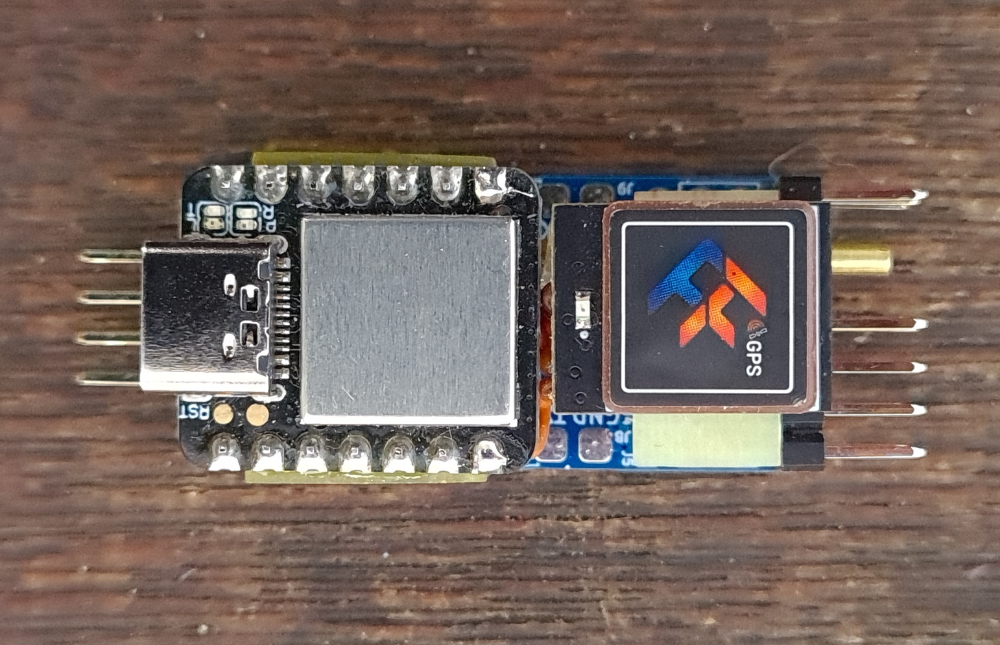
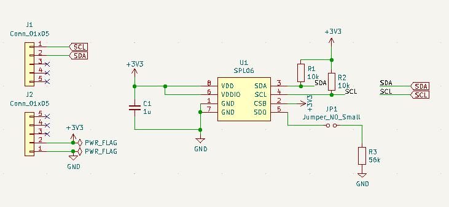
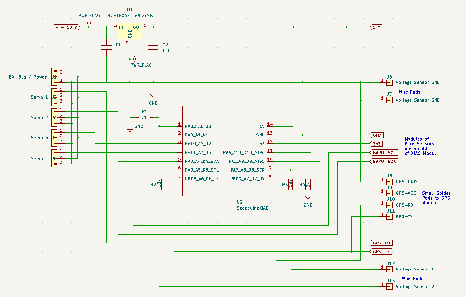
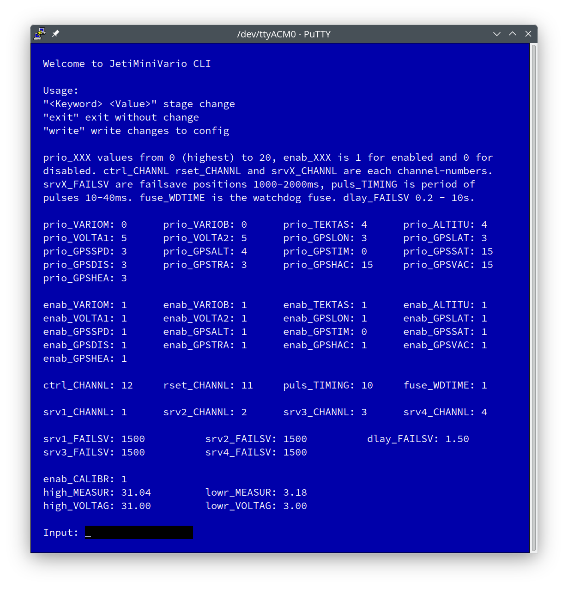

# JetiMiniVario2

## What it is
JetiMiniVario2 is a variometer and altimeter.
Optionally, a Ublox GNSS module (M8 or M10) can be connected.

JetiMiniVario was developed to detect smallest air movements with a DLG.

Communication with the GNSS (GPS) device is done using the UBX protocol over UART.
If the device is set to 9600 baud before (factory setting) the necessary
configuration is done automatically. The NavPvt data set with 10Hz refresh rate
is used. The serial interface works with 19200 baud.

Communication with the RC-receiver (Jeti EX Bus) is done with a low level 
configured UART Peripheral at 125000 Baud. It works half duplex on a single pin.
The DMA is used in order to achieve a proper timing without collisions.

Communication with the sensor boards is done over I2C at 500kHz. 

JetiMiniVario2 is built from the following components:

 * A MCU board Seeed Studio XIAO (SAMD21G18)

 * One or two shield boards with the SPL06-001 Barometric Pressure Sensor

 * A GNSS device with a M8 or M10 module from Ublox. (i.e. Beitian BN-XXX BE-XXX, FlyfishRC M10 mini, ...) 

JetiMiniVario is optimized for very short response times
with low noise. Due to a free RC channel the filtering can be
adjusted continuously and thus the variometer can be be calmed down.
A gas-tight volume is provided between the sensor boards.
By encapsulating the sensor PCBs with thin epoxy plates and attaching
a tube connection one sensor can be connected to a TEK probe. 

A voltage divider 1:10 (recommended 2k and 18k each 0.1%) can be connected
to PIN_A8. The 3.3V are used as reference so a voltage up to 33V can be
applied. Accuracy is 1/100 V if calibrated, see below.

Up to 4 Servos can be connected. The timing of the pulses (period) can
be adjusted from 10 to 40 ms. The mapping to the RC-channels of the the
EX-Bus is arbitary. Failsave positions can be adjusted for each servo.
The time from a fail to failsave is adjustable also.

There is a watchdog which monitors the main loop. If the loop time
exceeds 7.8 ms all sensors are bypassed and a fuse becomes triggered
within the configuration. If the loop time exceeds even 31 ms a system
reset becomes triggered also. This way the servo control is save in
case of a sensor hardware is blocking or delaying the loop.

The fuse can be set again by the terminal, see below.

Please use the bootloader from here:
https://github.com/adafruit/uf2-samdx1/releases
This bootloader has the brown-out detector implemented.
It prevents bootloader corruption due to unclean power cycles.
Please find it also within the UF2 folder.

## Mechanical design

The device can be assembled from several hardware parts according
to your individual needs. It could be a very small thing with the MCU-board only
or the full featured device with a baseboard.

  
  

The Sensor PCB has a Solder Jumper for changing the I2C address.
If 2 PCB's are in use, the sensor vwith the changed address becomes the
encapsulated one for TEK connection.  

First set the alternative address on one of the Sensors:  
  

In order to encapsulate a volume by the 2 sensor PCB's 
make both PCBs gasproof by using some epoxy on this sides:  
  

The sensor PCB's then can be stacked and encapsulate an air volume together with small epoxy stripes
Please refer to first version of JetiMiniVario:  
  

Top view
  

Sensor PCB:  
  

Base PCB:  
  

## Electrical limits

JetiMiniVario can be powered by the RC receiver.
The voltage should not not exceed 6V. The voltage regulator
on the XIAO has 7V as absolut maximum rating. 4 cells of NiMh
are probably ok. But most GNSS-modules are specified for max 5.5V
So it's better using a 5.5V BEC or an onboard LDO regulator like the
AMS1117 5.0V type, if the input voltage exceeds 5.5V. The current baseboard
uses an MCP1804 5V type. Power from 1 cell LiPo is perfectly ok for the
device itself and the GNSS-modul. The 3.3V regulator of the XIAO can power
the baro-sensor-pcbs VCC-pins in any setup.

## Software

### Libraries

The software uses two libraries:
* DPS
* JetiExBus

To load the two libs at the same time you can use this command line:

git clone --recursive https://github.com/nichtgedacht/JetiMiniVario2.git 
 
### IDE 
 
The repository here is to be used directly as a PlatformIO project.
It is as simple as:

* Install VSCode

* In VSCode install the PlatformIO extension. (Search by typing Plat...)

* Within PlatformIO open the directory of the repository as a project.
 
Because the Arduino Framework is used, the code can also be compiled in the Arduino IDE. 
For this, the extension for the SeedStudio XIAO must be installed first.
Then main.cpp must be renamed to JetiMiniVario.ino.
The correct board can then be selected in the board selection.

### Upload

Until the GNSS module was connected, the software was developed with a BlackMagicProbe
which also used the serial interface at A6 A7. 
The upload was done via the debug interface. In the current configuration
the upload is done via the USB-C connector.
It is of course still possible to work with the BlackMagicProbe if the
debug Serial.print goes through the USB-C connector. See "platformio.ini".
 
 
You can upload also one of the UF2 files:
* Short the reset contacts 2 times within 1/2 second.
* The yellow LED will slowly dim blink.
* The device will then register as mass storage
* Copy the UF2 file there

### LED Signals of application

* Yellow LED blinks 1Hz

For configurations without SERVO and with BARO (DUAL). 
Baro Hardware is missing or broken. 
Terminalserver can not be reached in this state.

* RX- and TX-LED (blue) solid on

For configurations with SERVO. 
Watchdog has triggered the fuse. Reset fuse with a terminal  
after checking the hardware.

* Yellow LED blinks 10Hz.

Normal operation with GPS (GNSS-modul).

* RX- and TX-LED (blue) and yellow LED solid on

Hard fault

### Configuration

There are only these defines at the beginning of config.h:
* //#define DEBUG // debug prints or not

* #define BARO // using a barometric pressure sensor 

* #define DUAL // using an additional barometric pressure sensor 

    If dual pressure sensors are used one is for the variometer and the other becomes 
    altitude.

* #define GPS  // using the GNSS Modul 

* #define VOLT // using the ADC 

* #define SERVO // enable servo output 
 
These defines depends on the assembled hardware. Please comment out what is not used 
or use the appropriate UF2 file
 
 

All other configuration can be done with a Command-Line-Interface:  

  

The following items can be configured with the CLI

* The RC-channel used for live adjusting the filters. 

  This RC-channel-value is assumed to go from 1000us to 2000us. 
  Time constants (Taus) of the main filter are then adjustable from about 0.4s (at 1000us) 
  to about 0.8s (at 2000us) 

* The RC-channel used to reset altitude and GNSS home position 

  The transition of channel value for reset must go from higher to lower 
  and difference must be greater than 300 (e.g. from 2000 to 1000 ). 
  Hint: Use the Servo Monitor. The transition must be instantanuosly. 
  If this switch is used for changing a flight mode also and there is a delay 
  i.e. a soft transition the reset will not work

* Priority of a sensor 

* Enable/disable a sensor   

* The RC-channel-mapping to the servo outputs   

* Period of servo pulses timing in ms   

* Failsave positions in micro s   

* Delay to failsave in s   

* Fuse of watchdog timer reset/set   
 
* Calibrate the voltage sensor (ADC)   

For calibrating the voltage sensor:
* Disable calibration
* Apply a voltage arround 3V
* Read the measured voltage
* Change the values for applied and measured voltages
* Do the same for a voltage arround 30V
* Enable calibration
* Write changes

Note that this calibration works precisely only for
the selected pin (VOLTA1 or VOLTA2). The deviation
of the other voltage then depends on the accuracy of
the choosen resistors.    

Legend:
* VARIOM Variometer
* VARIOB in DUAL-setup Variometer from static port no TEK
* TEKTAS True Airspeed calculated from Pressure Diff of TEK-Probe
* ALTITU Barometric Altitude
* VOLTA1 Voltage1
* VOLTA2 Voltage2
* GPSLON GPS Longtitude
* GPSLAT GPS Latitude
* GPSSPD GPS Speed
* GPSALT GPS Altitude
* GPSTIM GPS Time
* GPSSAT Number GPS Vehicles in use
* GPSDIS Calculated Value of GPS Distance to Home Position
* GPSTRA Calculated Value of GPS Travel Distance
* GPSHAC GPS Horizontal Accuracy
* GPSVAC GPS Vertical Accuracy
* GPSHEA GPS Bearing

As terminal emulation Putty can be used. The default settings 
of Putty are ok. 
* Just select the serial interface connected to the device 
* At least 83x38 (rows x colums) are needed for a complete window. 
* For proper viewing an 11 point Monospace Font is recommended.  
* Putty is available for Linux, and Windows.
